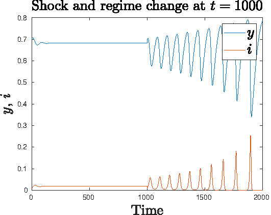

My research interest lies broadly in the area of behavioral macroeconomics and finance, nonlinear dynamics and mathematical epidemiology. In a departure from macroeconomic models with representative agents, my research focuses on the complex dynamics of interaction between heterogeneous agents with bounded rationality. This broad framework allows inclusion of factors like cognitive limitations of the agents
and limits of arbitrage in an incomplete market setting. My recent research in this direction has analyzed the impact of bounded rationality and limits of arbitrage on forex markets after Global Financial Crisis. Through formal models, I show in this work that an increase in prudential norms might be counter-productive, increasing (instead of decreasing) volatility in the forex markets. My research has also contributed to understanding the effect of monetary policy on growth and distribution of income in a world characterized by heterogeneous expectations and bounded rationality.

In recent years, following the outbreak of COVID-19 pandemic, one line of my research has been studying the interaction between macroeconomic and epidemiological factors in shaping the evolution of the pandemic. My research in this area has combined elements from mathematical epidemiological models with macroeconomic models in evaluating various policy choices involving vaccination and non-pharmaceutical interventions. My current ongoing research evaluates the choice between _Zero-Covid Policy_ and a policy 
involving _Living with Covid_, where I argue and provide evidence in favor of a Zero-Covid Policy. Apart from this, I have also been involved in research projects with my doctoral students, in diverse areas like international migration, political economy of the Arab Spring events, institutional economics, conflict and economic growth, capital controls, regional inequality, measuring returns to education, optimal currency areas in South Asia, etc. 

